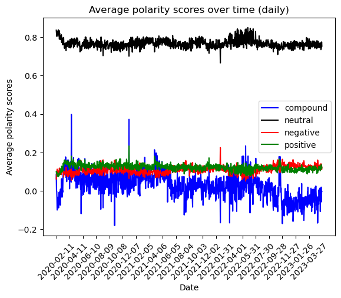
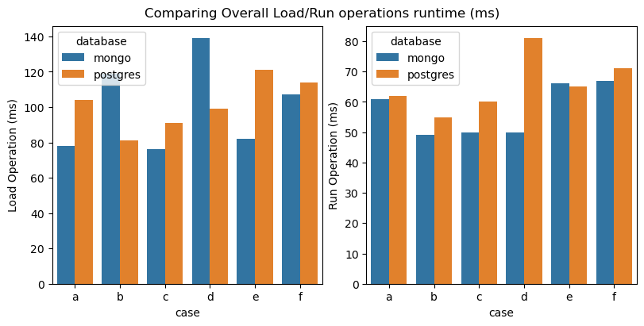
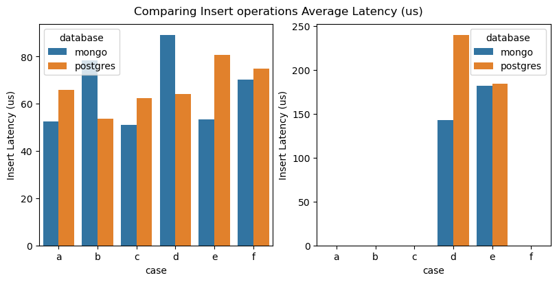
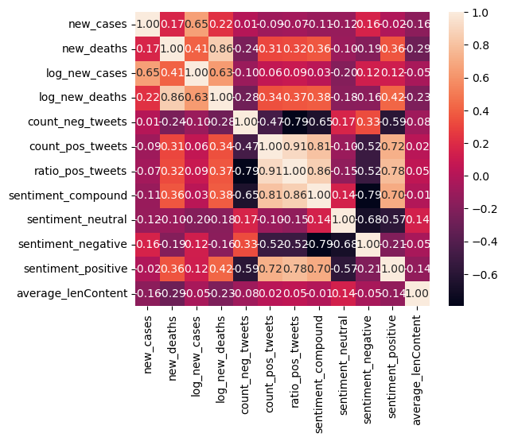
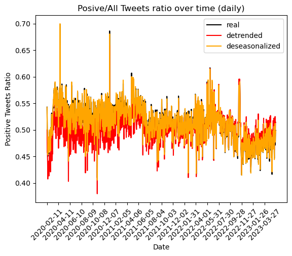
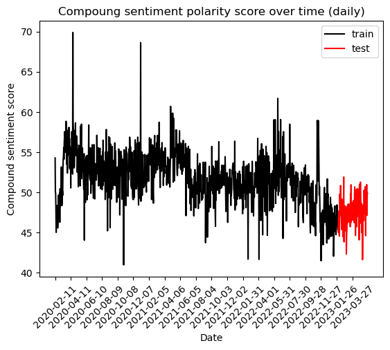
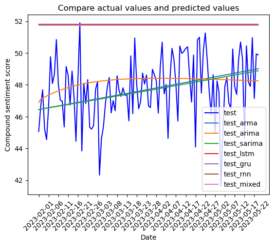
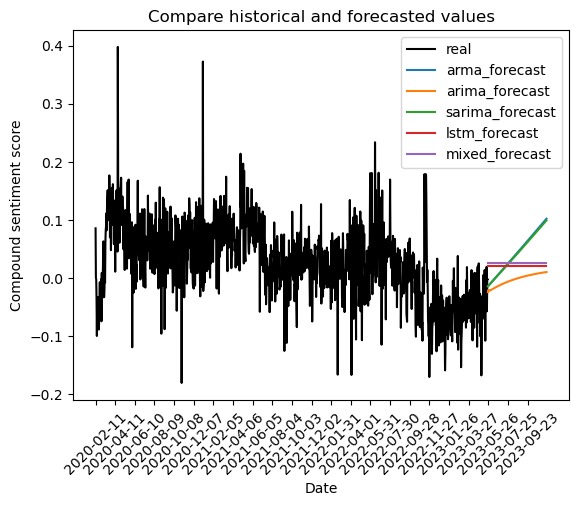

# Step 1) Data Collection
See [data_collection](./data_collection/Data%20Collection.ipynb) for more details.

Used [snscrape](https://github.com/JustAnotherArchivist/snscrape) to scrape Twitter advanced search results and collected tweets with #covid hashtag.

Overall scraping covid related tweets from 11-February-2020 to 24-May-2023 took around ~6 hours to complete, and collected around ~305.3K tweets.

Tweets are saved in different files to mimic a big data dataset, for example: [February-2020](./data_collection/2020-02.csv) data.

# Step 2) Sentiment Analysis
See [data_sentiment_analysis](./data_sentiment_analysis/AddSentiments.ipynb) for more details.

Reads data_collection save files, and uses [NLTK](https://www.nltk.org/) provided Sentimeny Analyzer [VADER](https://www.nltk.org/_modules/nltk/sentiment/vader.html) to score sentiment polarities of tweet contents. Tweets files are saved in [data_sentiment_analysis/data](./data_sentiment_analysis/data) directory to not override raw collected data.

This step adds 4 new columns to dataset:
* pos: Positive polarity score of the text between 0 to +1
* neu: Neutral polarity score of the text between 0 to +1
* neg: Negative polarity score of the text between 0 to +1
* compound: Compound polarity score of the text between -1 to +1 (-1 being negative and +1 being positive)

# Step 3.1) Database Benchmarking Comparison
See [ycsb_database_benchmark](./ycsb_database_benchmark/Compare%20Databases.ipynb) for more details.

Used [Yahoo! Cloud Serving Benchmark (YCSB)](https://github.com/brianfrankcooper/YCSB) to benchmark MongoDB and Postgred SQL.

[YCSB 0.17.0](https://github.com/brianfrankcooper/YCSB/releases/tag/0.17.0) version bindings in [ycsb-mongodb-binding-0.17.0.tar.gz](./ycsb_database_benchmark/ycsb-mongodb-binding-0.17.0) and [ycsb-postgrenosql-binding-0.17.0.tar.gz](./ycsb_database_benchmark/ycsb-postgrenosql-binding-0.17.0) are used, to benchmark 'basic' workload with load and run commands: [see bat file](./ycsb_database_benchmark/ycsb-mongodb-binding-0.17.0/basictest.bat).

Since next step will need to INSERT ~305K tweets into the database, compared INSERT operation latencies too:

By looking at these comparsions, MongoDB is the clear winner.

# Step 3.2) MongoDB and MapReduce
See [data_mongo_mapreduce](./data_mongo_mapreduce/MongoDB_MapReduce.ipynb) for more details.

Used [pymongo](https://pypi.org/project/pymongo/) interface to insert tweets into MongoDB collections, and ran [MapReduce](https://www.mongodb.com/docs/manual/core/map-reduce/) commands to aggregate several fields for each day. So, MapReduce created time series of the each tweet field, and saved it in a sigle file on disk that can be read onto RAM.

# Step 4.1) Time Series Analysis
See [time_series_analysis](./time_series_analysis/Analysis.ipynb) for more details.

Analyzed of the time series created from tweets, and COVID-19 [daily cases and deaths dataset](https://ourworldindata.org/explorers/coronavirus-data-explorer). Checked correlation of new cases and deaths with generated time series, but sentiments field's correlations were really low.

Also checked seasonalities/trends on the time series, there was a negative trend when looking at yearly averages, but there wasn't any seasonality in the time series. Detrending and deseasonalised number of positive tweets ratio over time:

# Step 4.2) Time Series Forecasting
See [time_series_forecasting](./time_series_forecasting/Forecast.ipynb) for more details.

Focused on compound sentiment polarity score changes over time, trained and tested 7 models:
* Statistical analysis models:
  * Autoregressive Moving Average (ARMA)
  * Autoregressive Integrated Moving Average (ARIMA)
  * Seasonal ARIMA (SARIMA)
* Artificial neural network models:
  * Neural Network with Long short-term memory (LSTM) layers
  * Neural Network with Gated recurrent unit (GRU) layers
  * Neural Network with Recurrent Neural Network (RNN) layers
  * Neural Network with mixed LSTM/GRU/RNN layers

Initially splitted the time series before 01-February-2023 for training, and after 01-February-2023 for testing. 

This allowed us to use training data (before 01-February-2023) while parameter tuning (used [Hyperopt - Tree of Parzen Estimators (TPE) algorithm](http://hyperopt.github.io/hyperopt/#hyperopt-distributed-asynchronous-hyper-parameter-optimization) to tune Statistical analysis models, and used [Keras - Hyperband Tuner](https://keras.io/api/keras_tuner/tuners/hyperband/) to tune Artificial neural network models), and 'forecast' after 01-February-2023 with real test data to compare how good the model predicted. 

Finally after tuning all models, Statistical analysis models perfored much better for our mixed sentiment data. Final foreccasts for next 6 months from today looks like the following.

So, our forecasting suggests a positive trend in near future.
